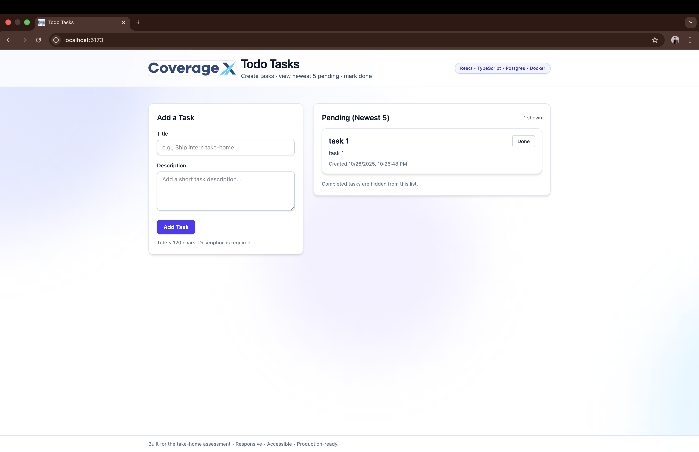

# Todo Tasks
React + TS + Vite • Node + Express + PG • Docker • Tailwind
## Screenshots

### Landing (empty state)

### Validation states
**Title required**  

**Description required**  

### Creating & listing tasks
**First task added**  

**Newest 5 pending (sorted desc)**  

### After completing tasks (empty again)

## Quick start (Docker)
cp .env.example .env
docker compose up --build
- Web: http://localhost:5173
- API: http://localhost:8080/health

## Local dev
docker compose up -d db
(cd api && npm i && npm run dev)   # :8080
(cd web && npm i && npm run dev)   # :5173

## Tech decisions
- Modules architecture (api/modules/tasks/*)
- Validation via zod, typed controllers/services
- DB pooling, migration-on-boot, index on created_at
- Tailwind v4, accessible focus & reduced-motion support
- Fixed footer + animated background (CPU-light)

## API
POST /api/tasks {title, description}
GET  /api/tasks
PATCH /api/tasks/:id/complete

